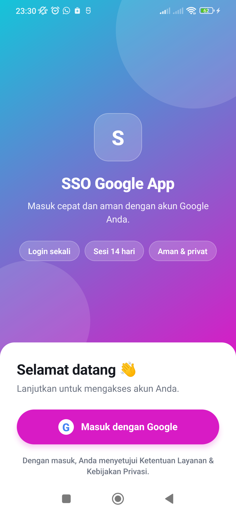
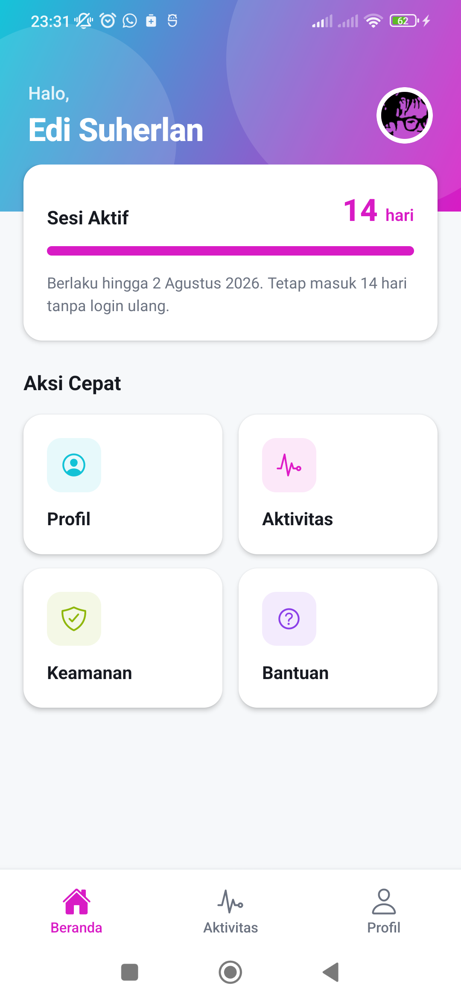
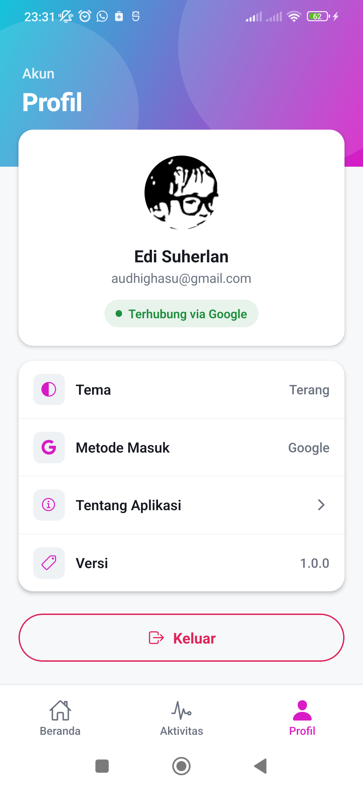
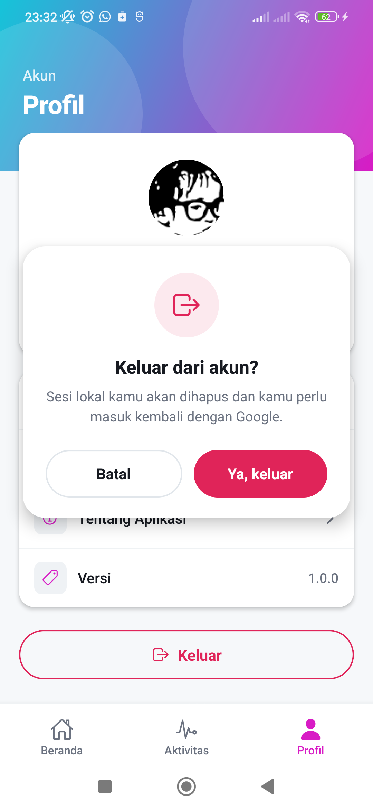
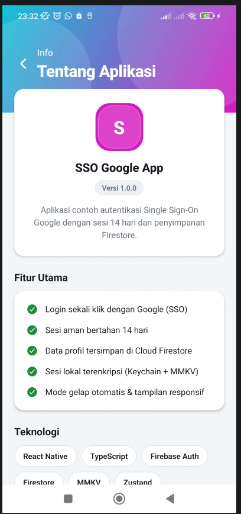

<div align="center">

# 🔐 React Native SSO Login Google

**Aplikasi contoh (learning project) autentikasi _Single Sign-On_ Google di React Native CLI**
dengan sesi lokal **14 hari** yang terenkripsi dan sinkronisasi profil ke **Cloud Firestore**.

[](https://reactnative.dev/)
[](https://www.typescriptlang.org/)
[](https://firebase.google.com/)
[](#)
[](#-lisensi)

</div>

---

## 📖 Tentang Proyek

**React Native SSO Login Google** adalah proyek pembelajaran yang mendemonstrasikan cara membangun
alur autentikasi modern di aplikasi mobile menggunakan **React Native CLI (bare workflow, tanpa Expo)**.

Fokus utama proyek ini adalah menunjukkan **praktik terbaik** untuk:

- 🔑 Login sekali klik dengan akun Google (SSO) melalui **Firebase Authentication**.
- 🗄️ Menyimpan & menyinkronkan profil pengguna ke **Cloud Firestore**.
- ⏳ Mempertahankan **sesi lokal selama 14 hari** dengan penyimpanan **terenkripsi** (MMKV + Keychain/Keystore) dan _sliding session_.
- 🎨 Membangun **UI/UX modern**: gradient, animasi, _collapsing header_, _pull-to-refresh_, _skeleton loading_, dan _dark mode_ otomatis.

> 💡 Cocok untuk mahasiswa/developer yang ingin memahami autentikasi mobile, manajemen state, dan penyimpanan aman secara end-to-end.

---

## 📑 Daftar Isi

- [Tangkapan Layar](#-tangkapan-layar)
- [Fitur Utama](#-fitur-utama)
- [Tech Stack](#-tech-stack)
- [Arsitektur](#-arsitektur)
- [Struktur Proyek](#-struktur-proyek)
- [Prasyarat](#-prasyarat)
- [Instalasi & Menjalankan](#-instalasi--menjalankan)
- [Konfigurasi Firebase](#-konfigurasi-firebase)
- [Cara Kerja Sesi 14 Hari](#-cara-kerja-sesi-14-hari)
- [Keamanan](#-keamanan)
- [Dokumentasi Lengkap](#-dokumentasi-lengkap)
- [Pembuat](#-pembuat)
- [Lisensi](#-lisensi)

---

## 📸 Tangkapan Layar

| Login | Beranda | Profil |
| :---: | :---: | :---: |
|  |  |  |
| **Gradient hero + tombol Google** | **Kartu sesi & aksi cepat** | **Profil & pengaturan** |

| Konfirmasi Keluar | Tentang Aplikasi |
| :---: | :---: |
|  |  |
| **Modal konfirmasi animatif** | **Info aplikasi & pembuat** |

---

## ✨ Fitur Utama

| Kategori | Fitur |
| --- | --- |
| **Autentikasi** | Login SSO Google (satu klik), logout dengan konfirmasi, penanganan error yang ramah |
| **Sesi** | Sesi lokal 14 hari, _sliding session_ (perpanjang otomatis saat aktif), kedaluwarsa otomatis |
| **Data** | Sinkronisasi profil (nama, email, foto, `uid`) ke Cloud Firestore |
| **Keamanan** | Penyimpanan sesi terenkripsi (AES-256), kunci disimpan di Keychain/Keystore, tanpa password |
| **Navigasi** | Bottom Tabs (Beranda, Aktivitas, Profil) + Stack (Tentang, Keamanan, Bantuan) |
| **UI/UX** | Design system tema terang/gelap, gradient, _collapsing header_, _pull-to-refresh_, _skeleton loading_, animasi (fade, scale, spring) |

---

## 🧰 Tech Stack

| Lapisan | Teknologi |
| --- | --- |
| **Framework** | React Native `0.86` (CLI / bare workflow) + React `19` |
| **Bahasa** | TypeScript `5.8` |
| **Autentikasi** | `@react-native-firebase/auth` + `@react-native-google-signin/google-signin` |
| **Database** | `@react-native-firebase/firestore` (Cloud Firestore) |
| **Penyimpanan lokal** | `react-native-mmkv` (terenkripsi) + `react-native-keychain` |
| **State management** | `zustand` |
| **Server state / cache** | `@tanstack/react-query` |
| **Navigasi** | `@react-navigation/native`, `native-stack`, `bottom-tabs` |
| **Validasi** | `zod` |
| **UI** | `react-native-linear-gradient`, `react-native-vector-icons`, Animated API |

---

## 🏗️ Arsitektur

```
┌─────────────────────────────────────────────────────────────┐
│                          UI (Screens)                         │
│   Splash · Login · Home · Activity · Profile · About · dst.   │
└───────────────┬───────────────────────────────┬──────────────┘
                │                               │
        ┌───────▼────────┐             ┌────────▼─────────┐
        │  authStore      │             │  React Query     │
        │  (Zustand)      │             │  (cache profil)  │
        └───────┬────────┘             └────────┬─────────┘
                │                               │
   ┌────────────▼─────────────┐      ┌──────────▼───────────┐
   │  Google Sign-In + Auth   │      │  userService         │
   │  (Firebase Auth)         │      │  (Firestore upsert)  │
   └────────────┬─────────────┘      └──────────┬───────────┘
                │                               │
        ┌───────▼────────────────────────────────▼───────┐
        │        Session Layer (14 hari, sliding)         │
        │   MMKV (AES-256)  +  Keychain/Keystore (key)    │
        └─────────────────────────────────────────────────┘
```

**Alur login singkat:**

1. Pengguna menekan **Masuk dengan Google** → `GoogleSignin` mengambil `idToken` **dan** `accessToken`.
2. Kedua token dipakai membuat `GoogleAuthProvider.credential()` → sign-in ke **Firebase Auth**.
3. Profil pengguna di-_upsert_ ke **Firestore** (`users/{uid}`).
4. Sesi lokal dibuat (berlaku 14 hari) dan disimpan terenkripsi.
5. Saat aplikasi dibuka lagi, sesi divalidasi; jika masih valid pengguna langsung masuk tanpa login ulang.

---

## 📂 Struktur Proyek

```
sso-google/
├── android/                     # Proyek native Android
│   └── app/
│       ├── google-services.json          # (diabaikan git — rahasia)
│       └── google-services.example.json  # template konfigurasi
├── docs/                        # Dokumentasi lengkap
│   ├── PRD.md                   # Product Requirements Document
│   ├── TDD.md                   # Technical Design Document
│   ├── SETUP.md                 # Panduan setup langkah demi langkah
│   ├── FIRESTORE_RULES.md       # Dokumentasi security rules
│   └── Screenshoot/             # Tangkapan layar aplikasi
├── src/
│   ├── auth/                    # authStore (Zustand), googleAuth, session
│   ├── components/              # Komponen UI reusable + animasi
│   ├── config/                  # Konstanta (TTL sesi, Web Client ID)
│   ├── navigation/              # RootNavigator, TabNavigator, types
│   ├── screens/                 # Semua layar aplikasi
│   ├── services/                # Inisialisasi Firebase & userService
│   ├── storage/                 # mmkv (terenkripsi) & keychain
│   ├── theme/                   # Design system (warna, spacing, tipografi)
│   └── types/                   # Tipe TypeScript
├── App.tsx                      # Root aplikasi (providers + navigator)
├── firestore.rules              # Security rules Firestore
└── README.md
```

---

## ✅ Prasyarat

Pastikan _environment_ React Native CLI Anda siap ([panduan resmi](https://reactnative.dev/docs/environment-setup)):

- **Node.js** ≥ 22.11.0
- **JDK** 17
- **Android Studio** + Android SDK (dan sebuah emulator / perangkat fisik)
- Akun **Firebase** (gratis)

---

## 🚀 Instalasi & Menjalankan

```bash
# 1) Clone repository
git clone https://github.com/edisuherlan/React-Native-SSO-Login-Google.git
cd React-Native-SSO-Login-Google

# 2) Install dependency
npm install

# 3) Siapkan konfigurasi Firebase (lihat bagian di bawah)
#    Salin template lalu isi dengan data proyek Firebase Anda:
#    android/app/google-services.example.json -> android/app/google-services.json

# 4) Jalankan Metro bundler
npm start

# 5) Build & jalankan di Android (terminal terpisah)
npm run android
```

> ⚠️ Setelah menambahkan modul native, jalankan ulang `npm run android` (bukan sekadar reload Metro).

---

## 🔥 Konfigurasi Firebase

File `android/app/google-services.json` **sengaja tidak di-commit** demi keamanan. Buat milik Anda sendiri:

1. Buka [Firebase Console](https://console.firebase.google.com/) → **Add project**.
2. **Authentication → Sign-in method →** aktifkan **Google**.
3. **Project Settings → Your apps → Android**, daftarkan package name: `com.audhighasu.sso`
   (atau ubah `applicationId` di `android/app/build.gradle` sesuai keinginan Anda).
4. Tambahkan **SHA-1** debug Anda (jalankan `./gradlew signingReport` di folder `android`).
5. Unduh `google-services.json` dan letakkan di `android/app/`.
6. Buat **Cloud Firestore** (mode production) dan pasang rules dari [`firestore.rules`](firestore.rules).
7. Salin **Web client ID** (client_type 3) ke `src/config/constants.ts` pada `GOOGLE_WEB_CLIENT_ID`.

📄 Panduan detail ada di **[docs/SETUP.md](docs/SETUP.md)**.

---

## ⏳ Cara Kerja Sesi 14 Hari

- Saat login berhasil, dibuat objek sesi berisi metadata + waktu kedaluwarsa (`now + 14 hari`).
- Sesi disimpan di **MMKV** yang dienkripsi **AES-256**; kunci enkripsinya disimpan di **Keychain/Keystore** perangkat.
- **Sliding session**: setiap aplikasi dibuka saat sesi masih valid, masa berlaku diperpanjang otomatis (bila mendekati ambang batas), sehingga pengguna aktif tidak perlu login ulang.
- Jika 14 hari berlalu tanpa aktivitas, sesi dianggap kedaluwarsa dan pengguna diminta login kembali.

Parameter dapat diatur di [`src/config/constants.ts`](src/config/constants.ts):

```ts
export const SESSION_TTL_MS = 14 * 24 * 60 * 60 * 1000; // 14 hari
export const SLIDING_SESSION = true;                    // perpanjang otomatis
export const SLIDING_REFRESH_THRESHOLD_MS = 60 * 60 * 1000;
```

---

## 🔒 Keamanan

- 🔐 **Enkripsi at-rest** — sesi lokal disimpan terenkripsi (AES-256) via MMKV.
- 🗝️ **Kunci di hardware aman** — encryption key disimpan di Keychain (iOS) / Keystore (Android).
- 🚫 **Tanpa password** — autentikasi sepenuhnya lewat Google, tidak ada kata sandi yang disimpan.
- 📜 **Firestore Rules** — akses koleksi `users` dibatasi hanya untuk pemilik `uid` yang terautentikasi.
- 🙈 **Rahasia tidak di-commit** — `google-services.json` & sejenisnya diabaikan melalui `.gitignore`.

---

## 📚 Dokumentasi Lengkap

| Dokumen | Deskripsi |
| --- | --- |
| [PRD.md](docs/PRD.md) | Product Requirements Document — tujuan, ruang lingkup, kebutuhan |
| [TDD.md](docs/TDD.md) | Technical Design Document — arsitektur & detail implementasi |
| [SETUP.md](docs/SETUP.md) | Panduan setup lengkap langkah demi langkah |
| [FIRESTORE_RULES.md](docs/FIRESTORE_RULES.md) | Penjelasan & kode security rules Firestore |

---

## 👤 Pembuat

**Edi Suherlan** — Frontend & React Native Developer · Dosen Informatika

- 🌐 Website: [audhighasu.com](https://audhighasu.com)
- ✉️ Email: [audhighasu@gmail.com](mailto:audhighasu@gmail.com)
- 💻 GitHub: [@edisuherlan](https://github.com/edisuherlan)
- 💼 LinkedIn: [in/edisuherlan](https://www.linkedin.com/in/edisuherlan/)

---

## 📄 Lisensi

Dirilis di bawah lisensi **MIT** — bebas dipelajari, dimodifikasi, dan digunakan untuk pembelajaran.

<div align="center">

⭐ Jika proyek ini bermanfaat untuk belajar, bantu beri _star_ ya!

</div>
