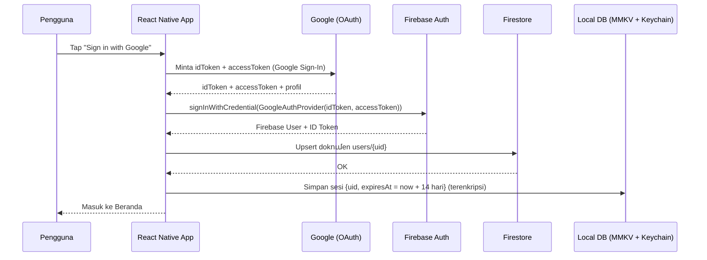
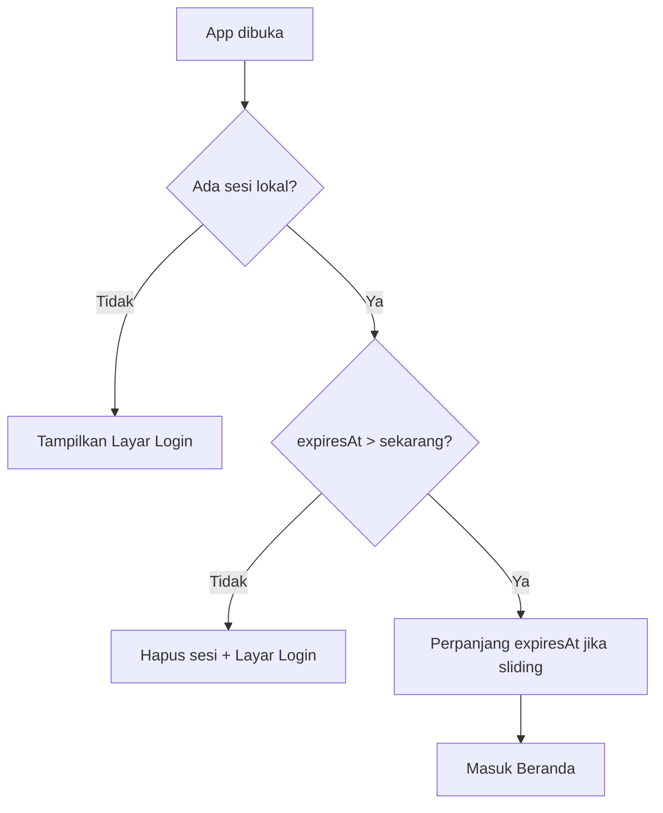

# PRD — Aplikasi React Native: Login SSO Google + Firestore + Session Lokal 14 Hari

| Field | Nilai |
|---|---|
| **Nama Produk** | SSO Google App (React Native) |
| **Versi Dokumen** | 1.0 |
| **Tanggal** | 19 Juli 2026 |
| **Status** | Draft |
| **Pemilik** | Mobile Engineering Team |
| **Platform** | Android & iOS |
| **Firebase Account** | edisuher0528@gmail.com |

---

## 1. Ringkasan Eksekutif

Aplikasi mobile lintas platform (Android & iOS) berbasis **React Native CLI (full native / bare workflow)** — **tanpa Expo** — yang memungkinkan pengguna melakukan autentikasi menggunakan **Single Sign-On (SSO) Google**. Pendekatan full native dipilih agar tim memiliki **fleksibilitas penuh** terhadap kode native (Android/iOS), native modules, dan konfigurasi build. Data profil dan metadata pengguna disimpan di **Cloud Firestore**, sedangkan **sesi login disimpan di database lokal** pada perangkat dengan masa berlaku **14 hari** agar pengguna tidak perlu login ulang setiap membuka aplikasi.

### Tujuan Utama
- Menyediakan proses login yang cepat, aman, dan tanpa gesekan (frictionless) melalui akun Google.
- Menjaga sesi pengguna tetap aktif selama 14 hari tanpa memerlukan koneksi konstan ke server.
- Menyimpan data pengguna secara terpusat dan real-time menggunakan Firestore.

---

## 2. Latar Belakang & Masalah

| Masalah | Dampak |
|---|---|
| Registrasi manual (email + password) memperlambat onboarding | Tingkat drop-off tinggi saat pendaftaran |
| Pengguna harus login berulang kali | Pengalaman pengguna buruk, retensi menurun |
| Pengelolaan password sendiri berisiko keamanan | Beban keamanan & kepatuhan meningkat |

**Solusi:** Delegasikan autentikasi ke Google (OAuth 2.0 / OpenID Connect), simpan sesi terenkripsi secara lokal, dan gunakan Firestore sebagai sumber kebenaran data pengguna.

---

## 3. Sasaran & Metrik Keberhasilan (KPI)

| Metrik | Target |
|---|---|
| Waktu login (klik → masuk beranda) | ≤ 3 detik |
| Success rate login SSO | ≥ 99% |
| Sesi valid bertahan tanpa login ulang | 14 hari penuh |
| Cold start dengan sesi valid → beranda | ≤ 1.5 detik |
| Crash-free sessions | ≥ 99.5% |

---

## 4. Ruang Lingkup

### 4.1 In-Scope (MVP)
- Login menggunakan Google SSO.
- Pembuatan/pembaruan profil pengguna di Firestore.
- Penyimpanan sesi lokal terenkripsi dengan TTL 14 hari.
- Auto-login saat sesi masih valid.
- Logout (menghapus sesi lokal + revoke Google).
- Perpanjangan sesi otomatis (sliding session) saat pengguna aktif.

### 4.2 Out-of-Scope (MVP)
- Login provider lain (Apple, Facebook, email/password).
- Push notification.
- Fitur bisnis di luar autentikasi (mis. pembayaran, chat).
- Multi-device session management panel.

---

## 5. Persona & User Stories

**Persona:** *Rina, 27 tahun* — pengguna smartphone yang ingin login cepat dan tidak suka mengingat banyak password.

| ID | User Story | Prioritas |
|---|---|---|
| US-01 | Sebagai pengguna, saya ingin login dengan akun Google agar tidak perlu membuat akun baru. | Must |
| US-02 | Sebagai pengguna, saya ingin tetap login selama 14 hari agar tidak perlu login ulang setiap hari. | Must |
| US-03 | Sebagai pengguna, saya ingin logout kapan saja agar akun saya aman di perangkat bersama. | Must |
| US-04 | Sebagai pengguna, saya ingin sesi otomatis diperpanjang selama saya aktif. | Should |
| US-05 | Sebagai pengguna, saya ingin diminta login ulang setelah 14 hari demi keamanan. | Must |

---

## 6. Arsitektur & Tech Stack (Metode Terbaru 2026)

### 6.1 Ringkasan Stack

| Lapisan | Teknologi | Alasan |
|---|---|---|
| **Framework** | **React Native CLI (bare/full native)** — terbaru (New Architecture: Fabric + TurboModules) | Fleksibilitas penuh atas kode native Android/iOS, tanpa batasan Expo |
| **Navigasi** | **React Navigation** (`@react-navigation/native` + native-stack) | Standar de-facto, performa native, fleksibel |
| **Bahasa** | **TypeScript** | Type-safety, mengurangi bug |
| **Autentikasi Google** | **`@react-native-google-signin/google-signin`** | Library standar & paling terpelihara untuk Google SSO native |
| **Backend Auth & Data** | **Firebase Authentication** + **Cloud Firestore** | Integrasi native dengan Google, real-time, serverless |
| **SDK Firebase** | **`@react-native-firebase/*`** (app, auth, firestore) | Performa native, dukungan penuh |
| **Session Storage (metadata)** | **`react-native-mmkv`** | Key-value storage tercepat, sinkron, mendukung enkripsi |
| **Secure Token Storage** | **`react-native-keychain`** (iOS Keychain / Android Keystore) | Menyimpan token sensitif di secure hardware |
| **State Management** | **Zustand** + **TanStack Query** | Ringan, modern, cocok untuk auth state & server cache |
| **Validasi** | **Zod** | Skema data & runtime validation |

> Catatan: Semua library di atas adalah native modules. Dengan React Native CLI, integrasi dilakukan via **CocoaPods (iOS)** dan **Gradle (Android)** secara langsung — memberi kontrol penuh atas konfigurasi native (autolinking sudah aktif secara default di RN modern).

### 6.2 Diagram Alur Autentikasi



### 6.3 Alur Auto-Login (Cold Start)



### 6.4 Desain UI/UX

Aplikasi mengusung tampilan **modern, responsif, dan mendukung mode gelap otomatis**.

**Prinsip desain**
- **Gradient hero + kartu**: setiap layar utama memakai latar gradient diagonal (biru → ungu) dengan "blob" dekoratif, dipadu kartu permukaan (surface) berbayang lembut.
- **Design system terpusat**: warna, spacing, radius, dan tipografi didefinisikan sekali di `src/theme/theme.ts` dan dipakai konsisten di seluruh komponen.
- **Dark mode otomatis**: mengikuti tema sistem via `useColorScheme` — light & dark palette disediakan.
- **Responsif**: konten dibatasi lebar maksimum (≤ 480px) dan di-tengah, sehingga rapi di HP kecil maupun tablet; tinggi hero relatif terhadap `useWindowDimensions`.
- **Aksesibilitas**: kontras memadai, `accessibilityRole`/`accessibilityLabel` pada tombol, area sentuh besar (tinggi tombol ≥ 52px).
- **Feedback interaksi**: `Pressable` dengan efek scale/opacity, indikator loading pada aksi async.
- **Aman terhadap notch**: menggunakan `SafeAreaView` (react-native-safe-area-context) dan status bar translucent.

**Navigasi**
- **Bottom Tab Navigator** (`@react-navigation/bottom-tabs`) dengan 3 tab: **Beranda**, **Aktivitas**, **Profil**.
- Ikon dari `react-native-vector-icons` (Ionicons), warna aktif mengikuti brand.
- Transisi antar stack (Splash/Login/Main) memakai animasi `fade`.

**Animasi & interaksi (modern)**
- **Entrance** kartu & list: fade + slide-up berjenjang (*stagger*) via `FadeInView`.
- **Progress bar sesi** mengisi dari 0 → target dengan animasi (`AnimatedBar`).
- **Efek tekan** (scale) pada kartu/tombol via `PressableScale`.
- **Collapsing header**: header gradient mengecil & judul menyusut saat konten di-scroll (`CollapsibleScreen`).
- **Pull-to-refresh**: tarik ke bawah untuk menyegarkan (RefreshControl) di setiap tab.
- **Skeleton loading**: placeholder berpulsa saat memuat data (`Skeleton`) di Beranda & Aktivitas.
- Semua memakai `Animated` bawaan RN (ringan, tanpa native module tambahan).

**Layar utama**
| Layar | Elemen kunci |
|---|---|
| Splash | Logo brand + spinner saat validasi sesi lokal |
| Login | Hero (logo, nama app, tagline, chip fitur) + kartu bawah berisi tombol Google & catatan ToS; menampilkan error inline |
| Beranda | Header gradient sapaan + avatar, **kartu sesi** (sisa hari + progress bar beranimasi), grid **Aksi Cepat** (4 kartu bisa ditekan → Profil, Aktivitas, Keamanan, Bantuan) |
| Aktivitas | Daftar riwayat (masuk, sesi dibuat, sinkron profil) dengan animasi masuk berjenjang |
| Profil | Kartu profil (avatar, nama, email, badge), daftar pengaturan (tema, metode masuk, **Tentang Aplikasi**, versi), tombol Keluar |
| Tentang Aplikasi | Halaman detail (fullscreen, tombol kembali): identitas app + versi, daftar fitur, chip teknologi, tautan (privasi/ToS/kontak), footer copyright |
| Keamanan | Ringkasan proteksi (enkripsi sesi, Keychain, kedaluwarsa 14 hari, tanpa password) + tombol "Akhiri Sesi Sekarang" |
| Bantuan | FAQ yang bisa dibuka-tutup + tombol "Hubungi Dukungan" |

---

## 7. Model Data

### 7.1 Firestore — Koleksi `users`

Dokumen: `users/{uid}`

```json
{
  "uid": "string (Firebase UID)",
  "email": "string",
  "displayName": "string",
  "photoURL": "string | null",
  "provider": "google.com",
  "createdAt": "Timestamp",
  "lastLoginAt": "Timestamp",
  "updatedAt": "Timestamp"
}
```

### 7.2 Local Session (MMKV — key `auth.session`, terenkripsi)

```ts
type LocalSession = {
  uid: string;
  email: string;
  displayName: string;
  photoURL: string | null;
  issuedAt: number;      // epoch ms saat login
  expiresAt: number;     // epoch ms = issuedAt + 14 hari
  lastActiveAt: number;  // untuk sliding session
};
```

### 7.3 Secure Store (react-native-keychain)

| Key | Nilai |
|---|---|
| `google.idToken` | ID token Google (sensitif) |
| `firebase.refreshToken` | Refresh token Firebase (opsional) |

---

## 8. Strategi Session 14 Hari

### 8.1 Aturan Masa Berlaku
- `SESSION_TTL = 14 hari` (dikonfigurasi konstanta, mis. `14 * 24 * 60 * 60 * 1000` ms).
- Saat login: `expiresAt = Date.now() + SESSION_TTL`.
- Saat cold start / resume app: validasi `Date.now() < expiresAt`.
- **Sliding session (opsional, direkomendasikan):** setiap pengguna aktif membuka app dalam masa valid, perbarui `expiresAt = Date.now() + SESSION_TTL` sehingga pengguna aktif tidak pernah logout paksa; pengguna tidak aktif > 14 hari akan diminta login ulang.

### 8.2 Kondisi Sesi Berakhir
- `expiresAt` terlewati.
- Pengguna menekan **Logout**.
- Token Firebase dicabut / akun dinonaktifkan (dicek saat ada operasi ke server).

### 8.3 Keamanan Penyimpanan
- Instance MMKV dibuat dengan `encryptionKey`.
- `encryptionKey` disimpan di **react-native-keychain** (iOS Keychain / Android Keystore), **bukan** hardcoded.
- Token sensitif tidak disimpan di MMKV biasa, melainkan di Keychain/Keystore.

---

## 9. Persyaratan Fungsional (FR)

| ID | Persyaratan | Prioritas |
|---|---|---|
| FR-01 | Sistem menampilkan tombol "Sign in with Google" di layar login. | Must |
| FR-02 | Sistem memperoleh `idToken` Google lalu menukarnya menjadi kredensial Firebase. | Must |
| FR-03 | Setelah login sukses, sistem membuat/memperbarui dokumen `users/{uid}` di Firestore. | Must |
| FR-04 | Sistem menyimpan sesi lokal terenkripsi dengan `expiresAt` = now + 14 hari. | Must |
| FR-05 | Saat app dibuka, sistem auto-login jika sesi lokal masih valid. | Must |
| FR-06 | Sistem memperpanjang sesi (sliding) saat pengguna aktif. | Should |
| FR-07 | Sistem menyediakan Logout yang menghapus sesi lokal & revoke sesi Google. | Must |
| FR-08 | Sistem meminta login ulang setelah sesi kedaluwarsa. | Must |
| FR-09 | Sistem menangani error (batal login, jaringan, token invalid) dengan pesan jelas. | Must |

---

## 10. Persyaratan Non-Fungsional (NFR)

| Kategori | Persyaratan |
|---|---|
| **Keamanan** | Token disimpan di secure hardware; MMKV terenkripsi; Firestore Security Rules ketat. |
| **Performa** | Cold start dengan sesi valid ≤ 1.5 detik menuju beranda. |
| **Offline** | Auto-login berfungsi tanpa jaringan (validasi sesi lokal murni lokal). |
| **Kompatibilitas** | Android 8+ (API 26) & iOS 15+; RN New Architecture (Fabric/TurboModules) aktif. |
| **Aksesibilitas** | Kontras & label tombol sesuai WCAG AA. |
| **Observability** | Logging error via Sentry/Crashlytics (opsional). |

---

## 11. Firestore Security Rules (Baseline)

```
rules_version = '2';
service cloud.firestore {
  match /databases/{database}/documents {
    match /users/{userId} {
      allow read, write: if request.auth != null
                         && request.auth.uid == userId;
    }
  }
}
```

Prinsip: pengguna hanya dapat membaca/menulis dokumennya sendiri.

---

## 12. Penanganan Error & Edge Case

| Kasus | Penanganan |
|---|---|
| Pengguna membatalkan dialog Google | Kembali ke layar login tanpa error keras. |
| Tidak ada koneksi saat login | Tampilkan pesan "Periksa koneksi internet". |
| `idToken` kadaluarsa/invalid | Ulangi flow login. |
| Sesi lokal korup | Hapus sesi & minta login ulang. |
| Jam perangkat dimanipulasi (bypass TTL) | Validasi tambahan ke server saat operasi sensitif (defense in depth). |
| Akun Google dihapus/dinonaktifkan | Deteksi saat operasi Firestore gagal → paksa logout. |

---

## 13. Struktur Proyek (Usulan)

```
sso-google/
├─ android/                  # Proyek native Android (Gradle, google-services.json)
├─ ios/                      # Proyek native iOS (CocoaPods, GoogleService-Info.plist)
├─ src/
│  ├─ navigation/
│  │  ├─ RootNavigator.tsx   # React Navigation: gate auth (auth stack vs app stack)
│  │  ├─ AuthStack.tsx       # Stack layar login
│  │  └─ AppStack.tsx        # Stack layar terproteksi
│  ├─ screens/
│  │  ├─ SplashScreen.tsx    # Gate auto-login (cek sesi lokal)
│  │  ├─ LoginScreen.tsx     # Layar login Google
│  │  └─ HomeScreen.tsx      # Beranda (protected)
│  ├─ auth/
│  │  ├─ authStore.ts        # Zustand store auth state
│  │  ├─ googleAuth.ts       # Wrapper Google Sign-In + Firebase
│  │  └─ session.ts          # Logika session 14 hari (MMKV + Keychain)
│  ├─ services/
│  │  ├─ firebase.ts         # Inisialisasi Firebase
│  │  └─ userService.ts      # Upsert users/{uid} Firestore
│  ├─ storage/
│  │  ├─ mmkv.ts             # Instance MMKV terenkripsi
│  │  └─ keychain.ts         # Wrapper react-native-keychain
│  └─ config/constants.ts    # SESSION_TTL, dsb.
├─ App.tsx                   # Entry: providers + RootNavigator
├─ index.js                  # Registrasi AppRegistry
├─ docs/
│  └─ PRD.md
├─ babel.config.js
├─ metro.config.js
├─ package.json
└─ tsconfig.json
```

---

## 14. Rencana Rilis (Milestones)

| Fase | Deliverable | Estimasi |
|---|---|---|
| **M1 — Setup** | Init React Native CLI + TS, Firebase project, Google OAuth client, konfigurasi native (Gradle/CocoaPods) | 2 hari |
| **M2 — Auth Core** | Google SSO → Firebase sign-in, upsert Firestore | 3 hari |
| **M3 — Session** | MMKV terenkripsi + Keychain, TTL 14 hari, auto-login, sliding | 3 hari |
| **M4 — UX & Error** | Layar login/beranda, logout, error handling, loading states | 2 hari |
| **M5 — Hardening** | Security Rules, QA, uji edge case, rilis internal | 2 hari |

---

## 15. Kriteria Penerimaan (Acceptance Criteria)

- [ ] Pengguna dapat login dengan Google dalam ≤ 3 detik.
- [ ] Dokumen `users/{uid}` terbuat/terupdate di Firestore setelah login.
- [ ] Menutup & membuka app dalam 14 hari → langsung masuk beranda (tanpa login).
- [ ] Setelah 14 hari tanpa aktivitas → diminta login ulang.
- [ ] Logout menghapus sesi lokal dan mencabut sesi Google.
- [ ] Sesi lokal tersimpan dalam bentuk terenkripsi (bukan plaintext).
- [ ] Firestore Security Rules mencegah akses lintas pengguna.

---

## 16. Risiko & Mitigasi

| Risiko | Mitigasi |
|---|---|
| Konfigurasi SHA-1/OAuth Google salah → login gagal | Dokumentasikan setup, gunakan `google-services.json` & `GoogleService-Info.plist` yang benar. |
| Native build gagal (Gradle/CocoaPods, versi tidak cocok) | Kunci versi RN & library, jalankan `pod install` setelah install, ikuti panduan setup tiap library. |
| Manipulasi jam perangkat melewati TTL | Validasi server-side untuk aksi sensitif. |
| Perubahan API library pihak ketiga | Kunci versi (lockfile) & pantau changelog. |

---

## 17. Dependensi Utama (Referensi)

```
react-native                       # via React Native CLI (bare)
typescript
@react-navigation/native
@react-navigation/native-stack
react-native-screens
react-native-safe-area-context
@react-native-google-signin/google-signin
@react-native-firebase/app
@react-native-firebase/auth
@react-native-firebase/firestore
react-native-mmkv                  # v4 (butuh react-native-nitro-modules)
react-native-nitro-modules
react-native-keychain
react-native-get-random-values     # sumber acak untuk encryption key
react-native-linear-gradient       # latar gradient UI
react-native-vector-icons          # ikon (Ionicons) untuk tab & UI
@react-navigation/bottom-tabs      # navigasi bottom tab
zustand
@tanstack/react-query
zod
```

> iOS: jalankan `cd ios && pod install` setelah menambah native modules. Android: pastikan `google-services` plugin & `google-services.json` terpasang di Gradle.

---

## 18. Lampiran — Konfigurasi Prasyarat

1. **Google Cloud Console:** buat OAuth 2.0 Client ID (Web + Android + iOS), aktifkan Google Sign-In. Simpan **Web Client ID** untuk `GoogleSignin.configure({ webClientId })`.
2. **Firebase Console:** buat project, aktifkan **Authentication → Google**, buat **Firestore Database** (mode production).
3. **Android:** daftarkan SHA-1 & SHA-256, unduh `google-services.json` → letakkan di `android/app/`; tambahkan `com.google.gms.google-services` plugin di Gradle.
4. **iOS:** unduh `GoogleService-Info.plist` → tambahkan ke Xcode project; atur **URL scheme** (REVERSED_CLIENT_ID); jalankan `pod install`.
5. **Environment RN CLI:** siapkan Node, JDK, Android Studio + SDK, Xcode + CocoaPods (macOS). Jalankan via `npx react-native run-android` / `run-ios`.

---

*Dokumen ini adalah PRD tingkat produk. Detail implementasi teknis akan diuraikan lebih lanjut dalam dokumen desain teknis (TDD) terpisah.*
